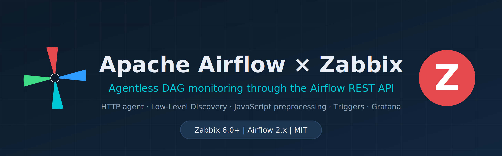
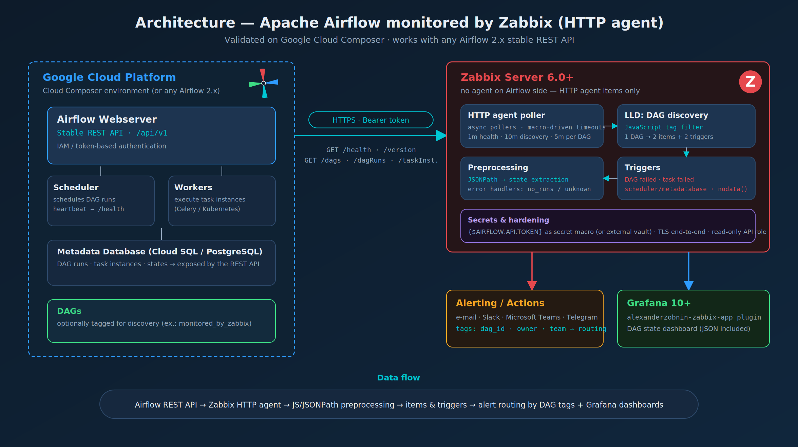
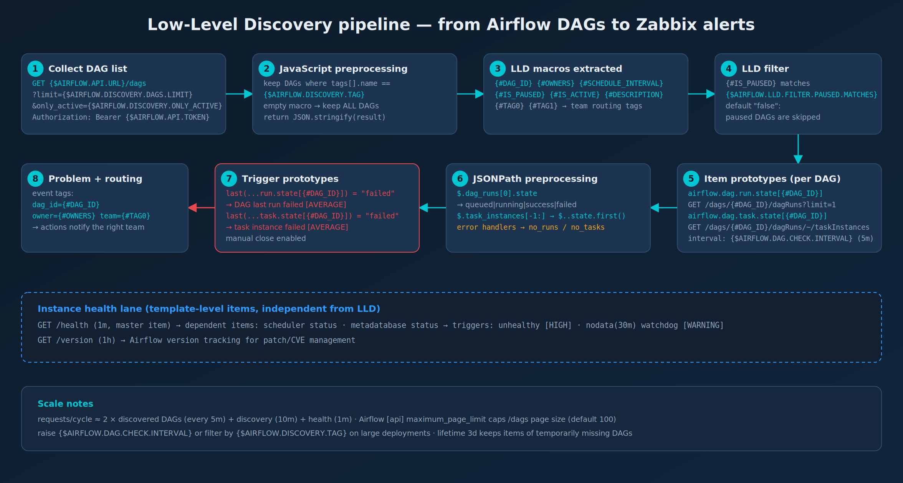

# Apache Airflow monitoring template for Zabbix (HTTP agent)



[](https://www.zabbix.com/documentation/current/)
[](https://airflow.apache.org/docs/apache-airflow/stable/stable-rest-api-ref.html)
[](https://cloud.google.com/composer/docs)
[](https://grafana.com/grafana/plugins/alexanderzobnin-zabbix-app/)
[](LICENSE)

**Agentless** monitoring of Apache Airflow with Zabbix, using only the
[Airflow stable REST API](https://airflow.apache.org/docs/apache-airflow/stable/stable-rest-api-ref.html)
(`/api/v1`) and Zabbix **HTTP agent** items — no agent, no exporter, no script on the
Airflow side. Every DAG is discovered automatically through **Low-Level Discovery (LLD)**
and gets its own items, triggers and routing tags.

Born from a real production integration between **Zabbix and Google Cloud Composer** in
the Brazilian payments industry, then sanitized, hardened and generalized for the
community. It works with **any Airflow 2.x** deployment that exposes the stable REST API:
Cloud Composer, Amazon MWAA or self-managed.

---

## Table of contents

- [Architecture](#architecture)
- [What you get](#what-you-get)
- [How discovery works](#how-discovery-works)
- [Requirements](#requirements)
- [Installation](#installation)
- [Authentication](#authentication)
- [Macros reference](#macros-reference)
- [Items and triggers](#items-and-triggers)
- [Grafana dashboard](#grafana-dashboard)
- [Tuning and scale](#tuning-and-scale)
- [Troubleshooting](#troubleshooting)
- [Security notes](#security-notes)
- [License](#license)

---

## Architecture



The Zabbix server (or proxy) polls the Airflow REST API over HTTPS with a Bearer token.
Three groups of checks run independently:

1. **Instance health** — `GET /health` every minute feeds a master item; dependent items
   extract the **scheduler** and **metadatabase** status. `GET /version` tracks the
   Airflow version for patch/CVE management.
2. **DAG discovery** — `GET /dags` every 10 minutes discovers DAGs (optionally filtered
   by an Airflow DAG tag) and creates per-DAG items and triggers via LLD.
3. **Per-DAG polling** — for each discovered DAG, the last **DAG run state** and the last
   **task instance state** are collected every 5 minutes.

Problems carry `dag_id`, `owner` and `team` event tags, so Zabbix actions can route each
alert to the team that owns the DAG — one template, many teams.

## What you get

| Capability | Detail |
|---|---|
| Instance health | Scheduler + metadatabase status from `/health`, with `HIGH` triggers when unhealthy |
| API watchdog | `nodata(30m)` trigger warns when Zabbix stops receiving data (token expired, network, webserver down) |
| Version tracking | Airflow version from `/version`, refreshed hourly |
| DAG auto-discovery | LLD over `GET /dags`, optional filtering by DAG tag, paused DAGs excluded by default |
| DAG run monitoring | Last DAG run state (`queued`/`running`/`success`/`failed`) per DAG |
| Task-level monitoring | Last task instance state per DAG — catches failed tasks even while the run is still `running` |
| Alert routing | Event tags `dag_id`, `owner`, `team` (from Airflow DAG tags/owners) for per-team notification routing |
| Grafana dashboard | Importable JSON for the [alexanderzobnin-zabbix-app](https://grafana.com/grafana/plugins/alexanderzobnin-zabbix-app/) plugin |
| Secure by default | Token stored as **secret macro**, TLS assumed, read-only API usage only (`GET`) |

## How discovery works



The discovery rule downloads the DAG list and runs a **JavaScript preprocessing** step
that filters DAGs by an Airflow DAG tag defined in `{$AIRFLOW.DISCOVERY.TAG}`:

- **Empty macro (default)** — every DAG returned by the API is discovered.
- **Tag set** (e.g. `monitored_by_zabbix`) — only DAGs carrying that tag in their
  `tags=[...]` definition are discovered. This inverts control to the data teams: they
  opt a DAG into monitoring by adding a tag in the DAG code, with zero change on Zabbix.

```python
# In the DAG definition — opting into monitoring when tag filtering is enabled
with DAG(
    dag_id="billing_daily",
    tags=["monitored_by_zabbix", "team-billing"],
    ...
):
```

The LLD filter then drops paused DAGs (configurable), and each surviving DAG generates
2 items + 2 triggers from the prototypes.

## Requirements

| Component | Version | Notes |
|---|---|---|
| Zabbix Server/Proxy | **6.0 LTS or newer** (6.0/6.4/7.0+) | Template exported in 6.0 YAML format |
| Apache Airflow | **2.x** | Stable REST API `/api/v1` enabled |
| Network | Zabbix → Airflow webserver over HTTPS | Outbound only, `GET` requests only |
| Credential | API token (or basic auth) | Read-only permissions are enough |

> Airflow 3.x moved the API to `/api/v2` with the same resources — adjust
> `{$AIRFLOW.API.URL}` and validate the payloads before use.

## Installation

1. **Import the template** — *Data collection → Templates → Import* →
   [`templates/zbx_apache_airflow_http_template.yaml`](templates/zbx_apache_airflow_http_template.yaml).
2. **Create a host** (e.g. `airflow-prod`) with no interface required, and link
   *Apache Airflow by HTTP*.
3. **Set the host macros**:
   - `{$AIRFLOW.API.URL}` → `https://<your-airflow-webserver>/api/v1`
   - `{$AIRFLOW.API.TOKEN}` → your token (**secret macro**)
   - optionally `{$AIRFLOW.DISCOVERY.TAG}` → e.g. `monitored_by_zabbix`
4. Wait for the first discovery cycle (≤10 min) and check *Monitoring → Latest data*.

Test the endpoint from the Zabbix server first:

```bash
curl -sf -H "Authorization: Bearer $TOKEN" \
  "https://<airflow-webserver>/api/v1/health" | jq
```

## Authentication

The template sends `Authorization: Bearer {$AIRFLOW.API.TOKEN}` on every request.

### Google Cloud Composer

Cloud Composer authenticates the Airflow REST API with **Google OAuth 2.0 access
tokens** ([docs](https://cloud.google.com/composer/docs/composer-2/access-airflow-api)):

1. Create a dedicated service account and grant it the **Composer User** role
   (least privilege — it only needs to *read* the API).
2. Generate an access token:

   ```bash
   gcloud auth print-access-token \
     --impersonate-service-account=zbx-airflow-ro@PROJECT.iam.gserviceaccount.com
   ```

3. Store it in `{$AIRFLOW.API.TOKEN}` (secret macro).

⚠️ Google access tokens **expire in ~1 hour**. For production, rotate the macro
automatically — a small cron/Cloud Function that fetches a fresh token and updates the
host macro via the [Zabbix API](https://www.zabbix.com/documentation/current/en/manual/api)
(`usermacro.update`) is the pattern we ran in production. The `nodata(30m)` watchdog
trigger tells you immediately if rotation ever breaks.

The webserver URL is shown in *Composer → Environment → Airflow web UI* (a
`*.composer.googleusercontent.com` address).

### Self-managed Airflow

With the [basic auth backend](https://airflow.apache.org/docs/apache-airflow/stable/security/api.html)
(`auth_backends = airflow.api.auth.backend.basic_auth`), either:

- keep the header and put a long-lived JWT/token if your deployment issues one, **or**
- change the header in the template to `Basic <base64(user:password)>` — create a
  dedicated **read-only** Airflow user (role `Viewer`/`User`) for Zabbix.

### Amazon MWAA

MWAA issues short-lived tokens via `create-web-login-token`/`create-cli-token`
([docs](https://docs.aws.amazon.com/mwaa/latest/userguide/access-mwaa-apache-airflow-rest-api.html)) —
same rotation pattern as Composer applies.

## Macros reference

| Macro | Default | Description |
|---|---|---|
| `{$AIRFLOW.API.URL}` | `https://airflow.example.com/api/v1` | Base URL of the stable REST API, no trailing slash |
| `{$AIRFLOW.API.TOKEN}` | *(secret)* | Bearer token for the `Authorization` header |
| `{$AIRFLOW.API.TIMEOUT}` | `15s` | Timeout of every HTTP agent request |
| `{$AIRFLOW.DISCOVERY.TAG}` | *(empty)* | Discover only DAGs with this Airflow tag; empty = all DAGs |
| `{$AIRFLOW.DISCOVERY.DAGS.LIMIT}` | `100` | Page size of `GET /dags` (see [Tuning](#tuning-and-scale)) |
| `{$AIRFLOW.DISCOVERY.ONLY_ACTIVE}` | `true` | `only_active` parameter of `GET /dags` |
| `{$AIRFLOW.LLD.FILTER.PAUSED.MATCHES}` | `false` | LLD filter on `{#IS_PAUSED}`; set `true\|false` to also monitor paused DAGs |
| `{$AIRFLOW.DAG.CHECK.INTERVAL}` | `5m` | Poll interval of the per-DAG items |

## Items and triggers

**Template-level items**

| Item | Key | Interval | Source |
|---|---|---|---|
| Get instance health (master) | `airflow.health.get` | 1m | `GET /health` |
| Metadatabase status | `airflow.health.metadatabase` | dependent | JSONPath `$.metadatabase.status` |
| Scheduler status | `airflow.health.scheduler` | dependent | JSONPath `$.scheduler.status` |
| Version | `airflow.version` | 1h | `GET /version` |

**Discovered per DAG**

| Item prototype | Key | Source |
|---|---|---|
| Last DAG run state | `airflow.dag.run.state[{#DAG_ID}]` | `GET /dags/{#DAG_ID}/dagRuns?order_by=-execution_date&limit=1` |
| Last task instance state | `airflow.dag.task.state[{#DAG_ID}]` | `GET /dags/{#DAG_ID}/dagRuns/~/taskInstances` |

**Triggers**

| Trigger | Severity | Expression (summary) |
|---|---|---|
| Scheduler is unhealthy | HIGH | `last(scheduler) <> "healthy"` |
| Metadatabase is unhealthy | HIGH | `last(metadatabase) <> "healthy"` |
| No data from REST API for 30m | WARNING | `nodata(metadatabase, 30m) = 1` |
| DAG `{#DAG_ID}`: last run failed | AVERAGE | `last(run.state) = "failed"` |
| DAG `{#DAG_ID}`: task instance failed | AVERAGE | `last(task.state) = "failed"` |

All triggers allow manual close; DAG triggers auto-resolve when a newer run/task
succeeds.

## Grafana dashboard

Import [`grafana/airflow_dag_monitoring_dashboard.json`](grafana/airflow_dag_monitoring_dashboard.json)
(*Dashboards → New → Import*) and select your Zabbix data source
([alexanderzobnin-zabbix-app](https://grafana.com/grafana/plugins/alexanderzobnin-zabbix-app/)
plugin required). Panels: scheduler/metadatabase/version stats, active Airflow problems,
and color-coded tables with the last run/task state of every DAG.

## Tuning and scale

- **Request budget**: ≈ `2 × discovered DAGs` every `{$AIRFLOW.DAG.CHECK.INTERVAL}`,
  plus discovery (10m) and health (1m). 50 monitored DAGs ≈ 20 req/min. Zabbix 6.0+
  async HTTP pollers handle this comfortably; raise the interval on large fleets.
- **Pagination**: Airflow caps the `/dags` page size with
  [`[api] maximum_page_limit`](https://airflow.apache.org/docs/apache-airflow/stable/configurations-ref.html#maximum-page-limit)
  (**default 100**). If you have more DAGs than that, either raise it
  (`AIRFLOW__API__MAXIMUM_PAGE_LIMIT` — a Composer environment override) and increase
  `{$AIRFLOW.DISCOVERY.DAGS.LIMIT}`, or reduce the set with `{$AIRFLOW.DISCOVERY.TAG}`.
- **Discovery lifetime is 3 days** — items of a DAG that disappears from the API are
  kept 3 days, then removed. Adjust in the discovery rule if you want faster cleanup.
- Use a **Zabbix proxy** close to the Airflow deployment (same VPC/region) to keep
  latency low and to avoid opening the webserver to your whole monitoring network.

## Troubleshooting

| Symptom | Check |
|---|---|
| Items `unknown` / discovery error | `curl` the endpoint with the same token from the Zabbix server/proxy; inspect *Latest data → item → error* |
| `nodata` trigger firing | Token expired (Composer tokens last ~1h — rotate!), DNS/firewall, webserver down |
| HTTP 403 | Service account missing **Composer User** role, or Airflow user lacks API permissions |
| Some DAGs not discovered | More DAGs than `maximum_page_limit`; tag filter excluding them; DAG paused (default LLD filter) |
| Value is `no_runs` / `no_tasks` | DAG discovered but never executed — not an error, triggers stay silent |
| JSONPath errors after Airflow upgrade | Airflow 3 renamed API paths to `/api/v2` — revalidate payloads |

## Security notes

- `{$AIRFLOW.API.TOKEN}` is declared as **secret text** macro — the value is never
  exported with the template and is masked in the UI. For stronger setups, resolve it
  from an external [vault](https://www.zabbix.com/documentation/current/en/manual/config/secrets)
  (HashiCorp Vault / CyberArk supported by Zabbix).
- The template only issues **read-only `GET`** requests — grant the credential the
  minimum role that can read DAGs/runs (`Viewer`-class), never an admin.
- Always front the webserver with **TLS**; never set `tlsSkipVerify`-style options in
  production.

## License

[MIT](LICENSE) — use it, fork it, improve it. PRs are welcome.

Developed by **Tiago Silva Leite** — battle-tested in a production Cloud Composer
environment before being published.

## References

- [Airflow stable REST API reference](https://airflow.apache.org/docs/apache-airflow/stable/stable-rest-api-ref.html)
- [Airflow health check endpoint](https://airflow.apache.org/docs/apache-airflow/stable/administration-and-deployment/logging-monitoring/check-health.html)
- [Access the Airflow REST API — Cloud Composer](https://cloud.google.com/composer/docs/composer-2/access-airflow-api)
- [Zabbix HTTP agent items](https://www.zabbix.com/documentation/current/en/manual/config/items/itemtypes/http)
- [Zabbix Low-Level Discovery](https://www.zabbix.com/documentation/current/en/manual/discovery/low_level_discovery)
- [Zabbix ↔ Grafana plugin](https://grafana.com/grafana/plugins/alexanderzobnin-zabbix-app/)
